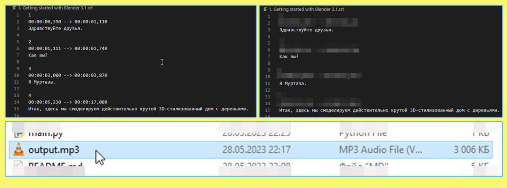

# Python Subtitle To Mp3

## Описание

Subtitle __*.srt__ to __*.mp3__

Озвучка субтитров. А так же убирание таймкодов из текста.

Сохранение полученного результата в отдельный звуковой файл.

---

## Использование

В main.py переменную `FILE` заменить на имя файла для озвучки!

Сейчас стоит `'1. Getting started with Blender 3.2.srt'`

Активировать виртуальное окружение (есть 2 способа)

Установить всё из `requirements.txt` не глобально в систему! А в `venv`.

Запустить скрипт можно через Windows cmd terminal `run.cmd`

Либо через VSCode, файл main.py, открыв терминал и запустив скрипт `ctrl + f5` либо значок Play.

---

## Гайд по созданию venv (виртуального окружения)

Создание виртуального окружения

Через интепритатор Python, который установлен в систему, ввести команду:

`python -m venv bogatov_subtitles`

Эта команда запускает модуль Python с именем "venv" для создания виртуального окружения Python в директории "bogatov_subtitles".

где:

`python` - интерпретатор Python.

`-m` - это флаг, который указывает запустить модуль Python как скрипт, а не импортировать его как библиотеку.

`venv` - это стандартный модуль Python, предназначенный для создания виртуальных окружений Python.

`bogatov_subtitles` - уникальное название виртуального окружения (можно написать любое слово), и по факту директория\папка внутри проекта, в которой будет создано виртуальное окружение.

После создания venv, далее его необходимо активировать!

---

## Гайд по активации venv в cmd

Доказательством его активации будет служить серый текст в скобочках слева:

Заменить путь на свой, и тупо запустить `run.cmd`

Внури bat-ника уже вписана команда по активации venv:

`cmd /k "cd /d E:\PythonSubtitle\bogatov_subtitles\Scripts & activate` 

Как видно, это всегда папка venvName\Scripts\ и файл activate.

---

## Гайд по активации venv в VSCode

Доказательством его активации будет служить зелёный текст в скобочках слева:

Есть хорошая команда в VSCode `Activate Env In Current Terminal` и по умолчанию она отключена!

И в user и в workspace.

Если её включить в настройках (File - Preferences - Settings - ввод в поиск фразы "Activate Env In Current Terminal"), то venv будет сразу автоматически активироваться при открытии и запуске проекта.

Вручную я активировал venv введя эти команды:

`bogatov_subtitles\Scripts\activate.bat`

`.\bogatov_subtitles\Scripts\activate`

Не 2 сразу! А какая-то из них.

---

## Как прочувствовать venv

Введя команду `pip list` - можно увидеть список установленных библиотек.

Таким образом, можно иметь 100500 версий библиотеки для разных проектов!

---

## Ссылки
| Описание | Ссылка |
| ------ | ------ |
Урок: | https://www.youtube.com/watch?v=APOPm01BVrk
Репо: | https://github.com/gitalexhubuser/PythonSubtitleToMp3
